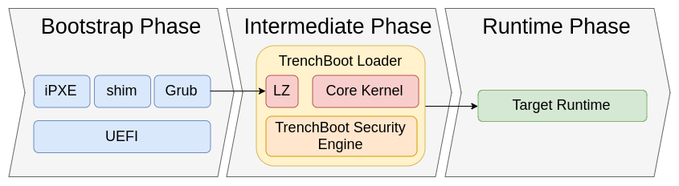

Data Center Launch
==================

## Purpose

To architect a TrenchBoot Loader that implements a [Late Launch](Linux_Late_Launch.md)
for virtualized environments that are launched through a network boot. The
intent will be to established platform integrity before allowing the running of
a data center environment as well as enable access to data center resources.

## Background

Data Centers, in particular those supporting cloud environment, use network
boot technologies like PXE as the initial boot chain to load these systems. A
TrenchBoot Late Launch solution must be designed to handle being launched via
PXE to establish a degree of integrity.

Challenges for this solution is dealing with the loading of a Network Bootstrap
Program (NBP) that is capable of initiating a Late Launch on Intel and AMD
platforms. With a Late Launch capable NBP it will then be possible to launch a
TSE that would attest to the state of the system before it would be allowed to
load DC's OS and potentially to overlay networks in the enterprise.

## Approach

This solution is the integration of multiple TrenchBoot capabilities into a
build configuration for TrenchBoot. The TrenchBoot capabilities include,
 * AMD and Intel Grub Late Launch
 * Linux Late Launch Kernel
 * u-root Security Engine core
 * u-root Security Engine unseal

Adjusting the general architectural flow diagram to reflect this configuration
can be seen in the diagram below.

