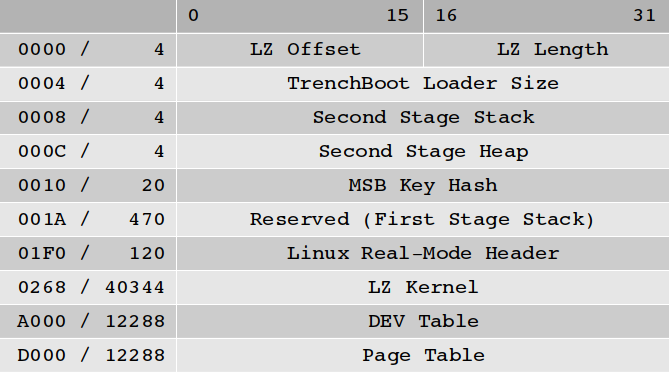

Linux Late Launch Kernel
========================

## Summary

The Linux kernel will be extended to make it function as the late launch kernel
for both AMD (Secure Loader) and Intel TXT (Measured Launch Environment). 

## Background

The late launch process provides a means to measure a target execution
environment and then jump into the environment as prescribed by the CPU's late
launch protocol. This process provides a means by which to a establish a
hardware-based Root of Trust for Measurement (RTM). The implementation here
will provide a means to launch the Linux kernel as an RTM environment to enable
building trust in a platform's launch.

## Approach

There are differences between AMD and Intel's Late Launch capabilities when it
comes to the software environments they launch. As a result each will have
different methods of bring up into the Linux kernel.

### AMD SKINIT

AMD defines the concept of a Secure Loader as the environment launched by the
SKINIT instruction. Within TrenchBoot we refer to the Secure Loader compliant
section of the Linux kernel as the Landing Zone (LZ). The AMD specification
states that the Secure Loader shall be no larger the 64kb, including the
stack. Conveniently the real mode boot segment of the Linux kernel is
specified to be 64kb to include stack. A break down of the first 64kb
of the Linux kernel memory can be seen in the following diagram.

#### Landing Zone

The initial implementation of the LZ will,
 1. Sanitize any CPU state passed through late launch
 2. Enter long mode
 2. Parse TrenchBoot and Linux headers
 3. DEV protect
    * Scratch area, second stage stack and heap
    * Remainder of Linux kernel
 4. Hash Linux kernel and extend into PCR 17
 5. Return to protected mode without paging
 5. Jump into 32bit kernel start routine

The long term capabilities sought are,
 * Verify LZ signature with pubkey
 * Verify measurement from LZ signature against CRTM
 * Create/Setup TPM Event log
 * Extend hash of pubkey into PCR 18, record in event log
